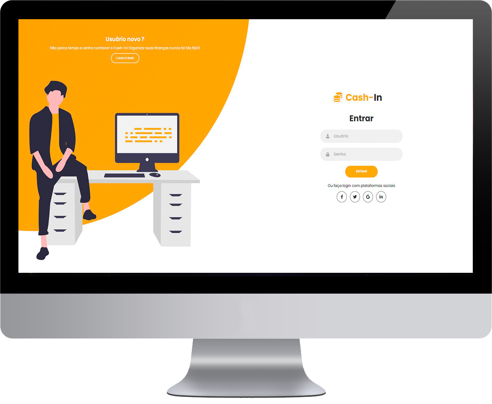
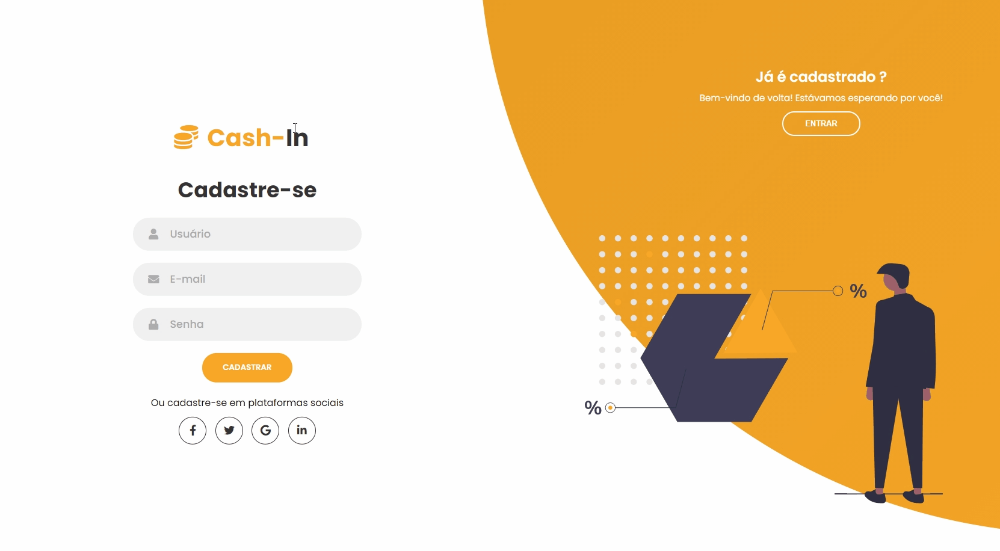
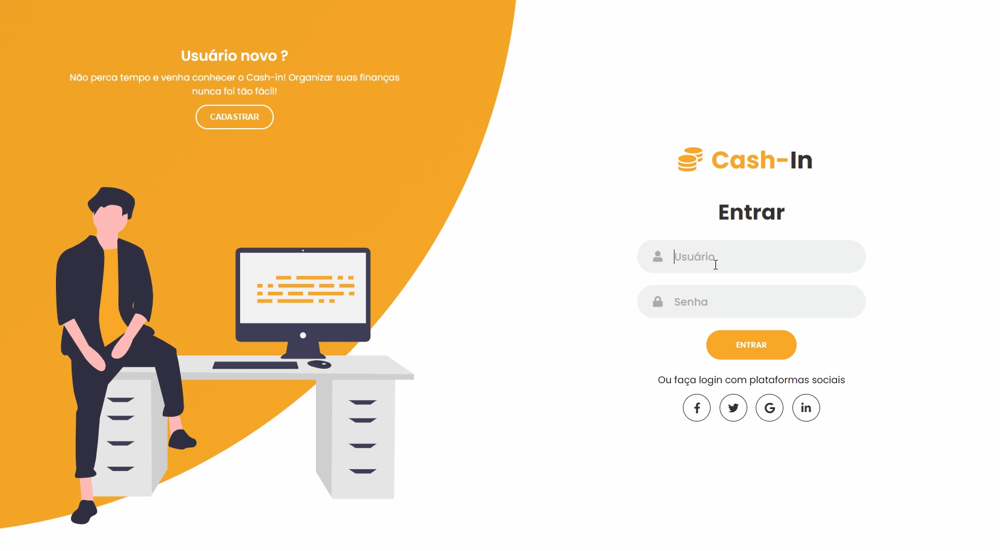
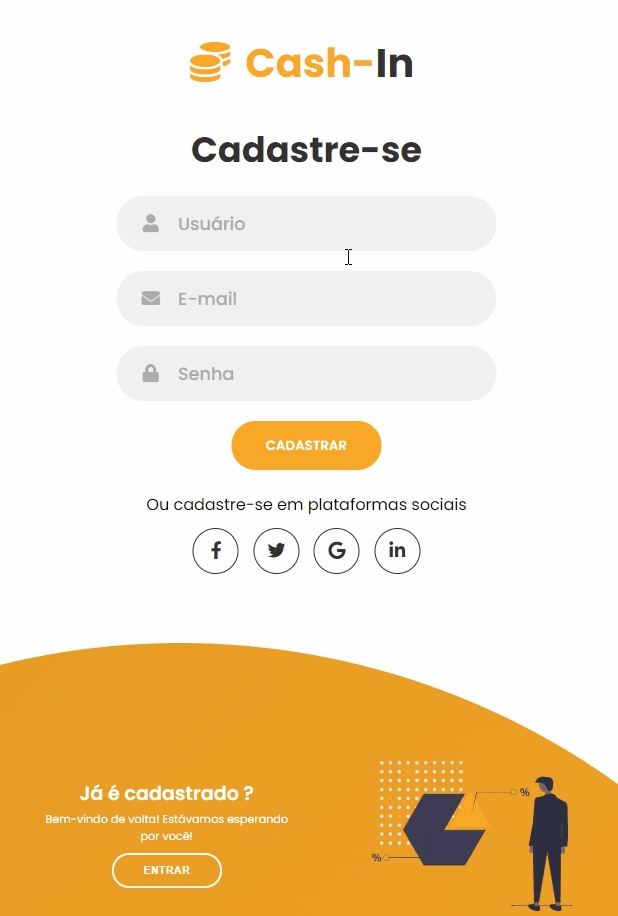
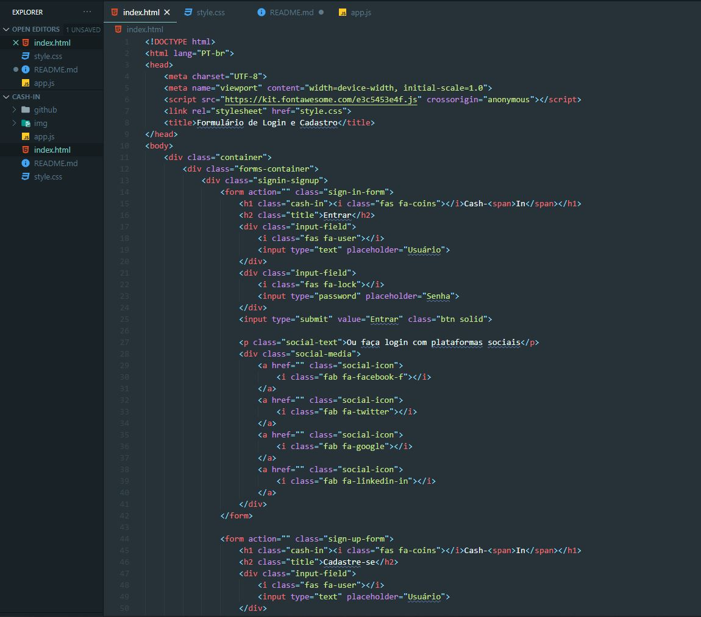

<h1 align="center">
    
</h1>

# Cash-in 
Projeto com o objetivo de adquirir conhecimento em HTML, CSS e um pouco de JavaScript. Cash-in é um formulário de login e cadastro moderno e muito bonito feito com o tutorial do canal True Code. Possui uma animação incrível deslizante, além de ser responsivo, se adaptando a dispositivos móveis.

Link do Tutorial: https://www.youtube.com/watch?v=piG91X4sV2U

  
  

## Com o que trabalhamos? 
✅ HTML

✅ CSS

✅ JavaScript

✅ Responsividade

✅ Grid

✅ Animação CSS

## :camera: Veja:

### Desktop

### Mobile

### Código:

